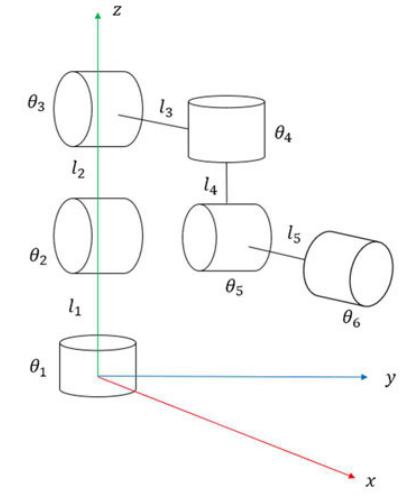
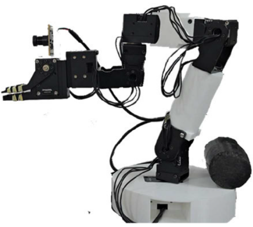
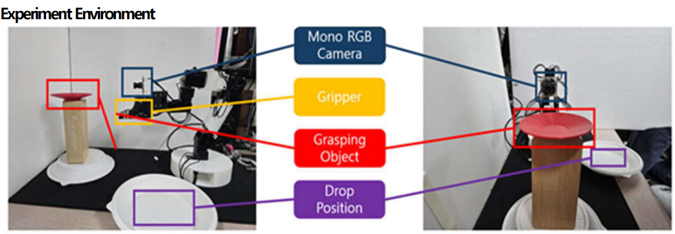
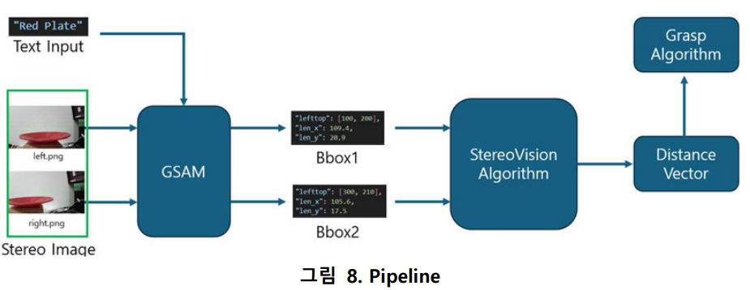

# 2024UGRP
## Abstract
Development of a Single-Camera Object Recognition and Grasping Robot Based on Grounded Segment Anything(GSAM)

## Introduction
Grasping random object is key problem of physical AI. Object grasping needs 3 steps. 1) Detect the precise position  and type of the object. 2) Compute grasping path. 3) Action. The goal of this project is to enable Step 1 to be carried out at a low cost.

Therefore, we decided to grasp a dish, which is symmetric and flat enough so that easy to design grasping path. 

## Problem Definition
To obtain accurate distance and orientation between the robot and an object, the commonly used approaches include:

1. measuring distance using a depth camera,

2. calculating the distance to the object using multiple images such as stereo images, and

3. estimating depth using methods such as monodepth AI.

We recognized several issues, including the fact that obtaining stereo images and depth requires camera equipment costing over $100, and that these methods may struggle to perform reliably in certain situations—such as environments with high reflectivity or ambiguous image feature points.

Instead, we focused on two points. First, the positional accuracy of the target object does not need to exceed the movement precision of the robot., and second, he field of image detection already offers many solid, lightweight, and well-performing models.

## Idea
Based on the two points mentioned above, we devised a method in which a single camera is used to take a picture of the object, then the robot is moved slightly to the right to take another picture, thereby obtaining images similar to stereo images. Then, by using an object detection algorithm to obtain the bounding box in each image, we devised a method to estimate the distance to the object based on the relative positional difference of the bounding boxes between the two images.

This will lessen the cost of camera because the only thing we need is a single mono-camera. This algorithm is also highly versatile, as it can compute the distance to any object detectable by the model. Furthermore, as object detection algorithms continue to improve, the range of objects that can be grasped through this process is expected to expand proportionally, demonstrating strong scalability.

## Hardware
<p align="center">
 
</p>

We designed 6dof manipulator with a single gripper for the project. The robot satisfies Pieper/s solution so the position of end effector can be caculated by simple kinematics. The final image of robot is in below.

<p align="center">
 
</p>

We conducted experiments in the following environment.
<p align="center">
 
</p>

## Pipeline
<p align="center">
 
</p>

When the target object is initially specified, the robot automatically takes a total of two photos of the object, separated by a small horizontal displacement. GSAM is run on each image to obtain the bounding box (BBOX) of the object in each image. Then. using the simple stereo vision algorithm (calculate distance by computing pixel distance of two centor of bbox) to compute the distance vector between robot and target object. 


## Run code
### Works on Ubuntu 22.04 LTS with CUDA 10.8

Clone the repository

``` bash
git clone https://github.com/skyview11/2024UGRP
```
Install modules for 6dof manipulator
```bash
conda create -n 6dof python==3.7 -y
cd 6dof-manipulation
pip install -r requirements.txt
cd ..
```

Run container for GSAM
You need to change mount directory in `run_container.sh`

```bash
cd 2024UGRP_modified_gsam
./run_conmtainer.sh
cd ..
```

Run robot manipulate code. You need robot here. 
``` bash
cd 6dof-manipulation
python main.py
```

Run GSAM algorithm
``` bash
python EfficientSAM/grounded_mobile_sam_modified.py
```

Write target object in line 130 of `6dof-manipulation/main.py` (Sorry for my laziness). 
``` python
 elif mode=="gsam":
    dist = self.stereo_depth_estimator.get_gsam_dist(left_img, ..., caption="blue_plate")
    print(dist)
```

Here is our video for successful grasping

https://www.youtube.com/watch?v=cM5_XhXyE6M
